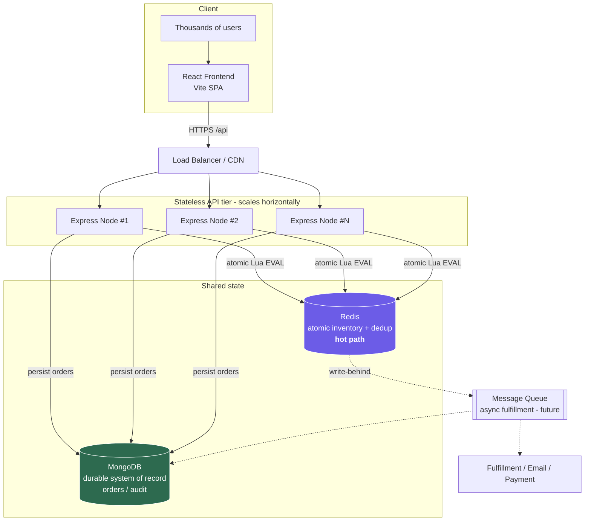
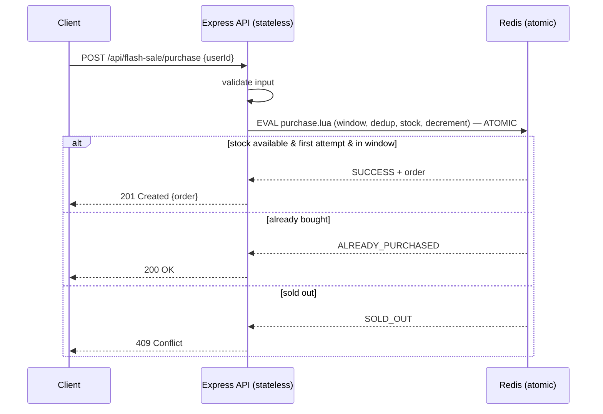

# ⚡ High-Throughput Flash Sale System

A simplified, production-minded flash sale platform for a single limited-stock product, built on the **MERN** stack (MongoDB, Express, React, Node.js) with **Redis** as the high-throughput concurrency layer.

It correctly enforces the two hard invariants of a flash sale **even under thousands of concurrent requests**:

1. **No overselling** — never sell more than the available stock.
2. **One item per user** — each user can secure at most one unit.

---

## Table of Contents

- [Architecture](#architecture)
- [Design choices & trade-offs](#design-choices--trade-offs)
- [How concurrency is handled (the core)](#how-concurrency-is-handled-the-core)
- [Project structure](#project-structure)
- [Getting started](#getting-started)
- [Configuration](#configuration)
- [API reference](#api-reference)
- [Testing](#testing)
- [Stress testing](#stress-testing)
- [Fault tolerance & scaling](#fault-tolerance--scaling)

---

## Architecture



**Request flow for a purchase:**



---

## Design choices & trade-offs

| Decision | Why | Trade-off |
| --- | --- | --- |
| **Express + Node.js (TS)** | Matches the MERN stack; mature, simple, huge ecosystem. | Slightly more boilerplate than Fastify, but the bottleneck is I/O, not the framework. |
| **Redis as the concurrency hot path** | Redis is single-threaded and runs Lua scripts **atomically**. The whole decision "is the sale open? has this user bought? is there stock? → decrement & record" collapses into **one indivisible O(1) operation**. No locks, no read-modify-write races. | Adds an infrastructure dependency. Mitigated by an in-memory fallback for local dev/tests. |
| **MongoDB as the durable system of record** | The "M" in MERN. Orders must survive restarts and be queryable for fulfillment/reporting/audit. Provides a second, fully-atomic implementation via `findOneAndUpdate` + a **unique index** on `userId`. | Disk-bound, so it's slower than Redis for the hot path. We therefore treat Redis as the gatekeeper and Mongo as the durable record. |
| **Pluggable store abstraction** (`memory` / `redis` / `mongo`) | One small interface, three implementations. Lets the same business logic and tests run with zero infra (`memory`), at max throughput (`redis`), or with full durability (`mongo`). Demonstrates the engineering trade-offs explicitly. | A thin layer of indirection. |
| **Idempotent purchase semantics** | A user retrying (or double-clicking) gets `ALREADY_PURCHASED` with their existing order rather than an error or a second unit. Critical under load where clients retry. | None meaningful. |
| **Stateless API tier** | No per-user state in the Node process → scale horizontally behind a load balancer just by adding instances. All shared state lives in Redis/Mongo. | Requires the shared store to be the source of truth (it is). |
| **Time window enforced inside the atomic op** | The sale's open/closed check happens in the same atomic step as the stock check, so there's no window where a request slips through at the boundary. | Relies on a single clock (the API server's). For multi-region you'd centralize time in Redis. |

### Why not a SQL row lock / `SELECT ... FOR UPDATE`?

That works but serializes purchases on a row lock and adds DB round-trips and contention under a traffic spike — exactly when you can least afford it. Redis' single-threaded atomic Lua gives the same correctness guarantee with far higher throughput and no lock contention.

### Why not just decrement an in-memory counter?

It's correct **within a single Node process** (JS is single-threaded), which is why the `memory` store passes the same concurrency tests. But the moment you run **more than one API instance** (which you must, to scale), each process has its own counter and you oversell. A shared atomic store (Redis) is required for horizontal scaling.

---

## How concurrency is handled (the core)

### Redis store — one atomic Lua script

The entire purchase decision is a single `EVAL`. Because Redis executes the script atomically, no two concurrent requests can interleave:

```lua
-- KEYS[1]=stock, KEYS[2]=orders hash ; ARGV: userId, now, start, end, orderId
local stock = redis.call('GET', KEYS[1])
if stock == false then return {'NOT_INITIALIZED', ''} end
if now < startTime then return {'NOT_STARTED', ''} end
if now > endTime then return {'ENDED', ''} end
if redis.call('HGET', KEYS[2], ARGV[1]) then return {'ALREADY_PURCHASED', existing} end
if tonumber(stock) <= 0 then return {'SOLD_OUT', ''} end
redis.call('DECR', KEYS[1])
redis.call('HSET', KEYS[2], ARGV[1], order)
return {'SUCCESS', order}
```

See [`server/src/store/redisStore.ts`](server/src/store/redisStore.ts).

### MongoDB store — atomic conditional update + unique index

Works on a standalone `mongod` (no transactions required):

1. **Insert the order first** — a `unique` index on `userId` makes the database itself reject duplicate buyers (atomic "one per user").
2. **Atomically claim stock** — `findOneAndUpdate({ stock: { $gt: 0 } }, { $inc: { stock: -1 } })`. MongoDB applies this to a single document atomically, so stock can never go negative (no overselling).
3. If no stock was left, **compensate** by deleting the reservation.

See [`server/src/store/mongoStore.ts`](server/src/store/mongoStore.ts) for the full reasoning, including the crash-recovery trade-off.

### Memory store — synchronous critical section

The in-process store performs its check-and-decrement **synchronously** (no `await` mid-operation), so it's atomic within one Node process — perfect for tests and zero-dependency demos. See [`server/src/store/memoryStore.ts`](server/src/store/memoryStore.ts).

---

## Project structure

```
.
├── server/                 # Express + TypeScript API
│   ├── src/
│   │   ├── app.ts          # Express app factory (routes, validation, errors)
│   │   ├── index.ts        # Entrypoint + graceful shutdown
│   │   ├── config.ts       # Env-driven configuration
│   │   ├── service.ts      # Business orchestration / sale-state derivation
│   │   ├── types.ts        # Shared types + the FlashSaleStore interface
│   │   └── store/
│   │       ├── memoryStore.ts   # In-process (default; tests/dev)
│   │       ├── redisStore.ts    # Atomic Lua (high throughput)
│   │       └── mongoStore.ts    # Durable, atomic via unique index + $inc
│   └── test/
│       ├── unit/store.test.ts            # store correctness + concurrency
│       └── integration/                  # API (supertest) + Redis/Mongo
├── frontend/               # React + Vite SPA
│   └── src/{App.tsx,api.ts,styles.css,main.tsx}
├── stress/
│   ├── stress.mjs              # throughput benchmark (autocannon)
│   └── verify-correctness.mjs  # proves no-oversell & one-per-user under load
├── docker-compose.yml      # Redis + MongoDB
└── package.json            # npm workspaces + top-level scripts
```

---

## Getting started

### Prerequisites

- **Node.js ≥ 18** (developed on Node 21)
- **Docker** (optional — only needed for the Redis/Mongo backends; the default `memory` store needs nothing)

### 1. Install

```bash
npm install
```

### 2. Run (quickest path — zero infrastructure)

```bash
# Terminal A: API on http://localhost:3000 using the in-memory store
npm run dev:server

# Terminal B: React app on http://localhost:5173 (proxies /api to the server)
npm run dev:web
```

Open **http://localhost:5173**, enter a username/email, and click **Buy Now**.

Or run both at once:

```bash
npm run dev
```

### 3. Run with Redis (high-throughput mode) or MongoDB (durable mode)

```bash
docker compose up -d        # starts Redis (6379) and MongoDB (27017)

# Redis-backed (recommended for the load test):
#   PowerShell:  $env:STORE="redis"; npm run dev:server
#   bash:        STORE=redis npm run dev:server

# MongoDB-backed (durable):
#   PowerShell:  $env:STORE="mongo"; npm run dev:server
#   bash:        STORE=mongo npm run dev:server
```

### 4. Production build

```bash
npm run build       # builds server (tsc) and frontend (vite)
npm start           # runs the compiled server (server/dist/index.js)
```

---

## Configuration

All configuration is via environment variables (sensible defaults provided):

| Variable | Default | Description |
| --- | --- | --- |
| `PORT` | `3000` | API port |
| `STORE` | `memory` | `memory` \| `redis` \| `mongo` |
| `TOTAL_STOCK` | `100` | Units available for the sale |
| `SALE_START` | now | ISO string or epoch ms — when the sale opens |
| `SALE_END` | now + 2h | ISO string or epoch ms — when the sale closes |
| `REDIS_URL` | `redis://127.0.0.1:6379` | Redis connection string |
| `MONGO_URL` | `mongodb://127.0.0.1:27017/flashsale` | Mongo connection string |
| `ENABLE_ADMIN` | `true` | Exposes `POST /api/admin/reset` (used by tests/stress) |

> By default the sale is **active immediately** so the demo and stress tests work out of the box.

---

## API reference

| Method | Endpoint | Description |
| --- | --- | --- |
| `GET` | `/api/flash-sale/status` | Sale state (`upcoming`/`active`/`sold_out`/`ended`), stock, sold count, window |
| `POST` | `/api/flash-sale/purchase` | Attempt a purchase. Body: `{ "userId": "ada@example.com" }` |
| `GET` | `/api/flash-sale/purchase/:userId` | Check whether a user secured an item (returns their order) |
| `POST` | `/api/admin/reset` | Reset stock & clear buyers. Body: `{ "totalStock": 100 }` (testing/stress) |
| `GET` | `/health` | Liveness probe |

**Purchase outcomes → HTTP status:**

| Status | HTTP | Meaning |
| --- | --- | --- |
| `SUCCESS` | `201` | Item secured |
| `ALREADY_PURCHASED` | `200` | User already owns one (idempotent) |
| `SOLD_OUT` | `409` | No stock left |
| `NOT_STARTED` / `ENDED` | `403` | Outside the sale window |
| invalid input | `400` | Missing/invalid `userId` |

Example:

```bash
curl -X POST http://localhost:3000/api/flash-sale/purchase \
  -H "Content-Type: application/json" \
  -d '{"userId":"ada@example.com"}'
```

---

## Testing

```bash
npm test          # runs the server unit + integration suite (Vitest)
```

- **Unit tests** (`test/unit/store.test.ts`) verify the store invariants directly, including a **5,000-concurrent-attempt** no-oversell test and a one-per-user-under-concurrency test.
- **Integration tests** (`test/integration/api.test.ts`) exercise the real Express app end-to-end with **supertest**: purchase, idempotency, sold-out, order lookup, input validation, and sale-window enforcement (before/after).
- **Redis & Mongo store tests** (`test/integration/redisStore.test.ts`, `mongoStore.test.ts`) run **10,000** (Redis) and **3,000** (Mongo) concurrent attempts and assert *exactly* `stock` successes. They **auto-skip** if the datastore isn't reachable, so `npm test` always passes with zero infra.

To include the Redis/Mongo tests, start the containers first:

```bash
docker compose up -d
npm test            # now 16/16 tests run (none skipped)
```

---

## Stress testing

Two complementary tools live in [`stress/`](stress/). **Start the server first**, ideally with Redis:

```bash
docker compose up -d
# PowerShell:  $env:STORE="redis"; $env:DISABLE_REQUEST_LOGGING="true"; npm start
# bash:        STORE=redis DISABLE_REQUEST_LOGGING=true npm start
```

### 1. Correctness under load — `npm run stress:verify`

This is the test that **proves the invariants**. It fires thousands of requests and asserts on the exact outcome:

```bash
npm run stress:verify
# tunable: STOCK=100 USERS=5000 BASE_URL=http://localhost:3000 npm run stress:verify
```

**Expected output:**

```
[Test 1] No oversell: 5000 distinct users vs stock=100
  Outcomes: { SUCCESS: 100, SOLD_OUT: 4900 }
  PASS: exactly 100 SUCCESS
  PASS: remaining stock is 0
  PASS: sold count is 100
[Test 2] One item per user: 50 spammers x 20 concurrent requests each
  Outcomes: { SUCCESS: 50, ALREADY_PURCHASED: 950 }
  PASS: each of 50 users won exactly once
ALL CHECKS PASSED — no overselling, one item per user upheld under load.
```

➡️ **5,000 users fought over 100 units and exactly 100 were sold. 1,000 duplicate requests from 50 users yielded exactly 50 winners.**

### 2. Throughput benchmark — `npm run stress`

Measures requests/sec and latency with `autocannon`:

```bash
npm run stress
# tunable: CONNECTIONS=200 DURATION=15 STOCK=1000000 BASE_URL=... npm run stress
```

**Representative result** (Redis store, single API process, dev laptop — Windows, Node 21):

| Metric | Value |
| --- | --- |
| Throughput | **~6,600 req/s** sustained |
| Latency p50 | **22 ms** |
| Latency p99 | **36 ms** |
| Errors | **0** |

The in-memory store reaches ~7,000 req/s on the same box. These numbers are from a single Node process; because the API tier is **stateless**, throughput scales roughly linearly by adding instances behind a load balancer — Redis (≈100k+ ops/s on one node) is nowhere near saturated.

---

## Fault tolerance & scaling

- **No overselling under failure:** the decrement and the order record are written in the **same atomic operation**, so a crash can never leave stock decremented without a recorded order (Redis), and the Mongo path compensates on the rare interleaving.
- **Safe retries:** purchases are **idempotent per user**, so clients (and load balancers) can retry freely without double-charging or consuming extra stock.
- **Durability:** Redis runs with **AOF persistence** (`--appendonly yes` in `docker-compose.yml`); MongoDB is the durable record of orders. In production you'd add Redis replicas + Sentinel/Cluster and a Mongo replica set.
- **Horizontal scale:** the API is stateless — add Node instances behind a load balancer. All contention is resolved in Redis, which is O(1) per purchase.
- **Graceful shutdown:** `SIGINT`/`SIGTERM` drain in-flight requests and close datastore connections before exit.
- **Future work (mocked here):** a **message queue** (e.g. RabbitMQ/SQS) for async fulfillment — Redis grants the "reservation" instantly on the hot path and a worker drains the queue to handle payment/email/shipping, decoupling the spike from slow downstream systems. This is shown as a dotted component in the architecture diagram.

---

## Summary

This project demonstrates a flash sale system that is **correct under heavy concurrency** (proven by tests *and* a load harness), **scalable** (stateless API + atomic shared store), and **pragmatic** (a single small store interface with three backends that make the throughput-vs-durability trade-off explicit).
