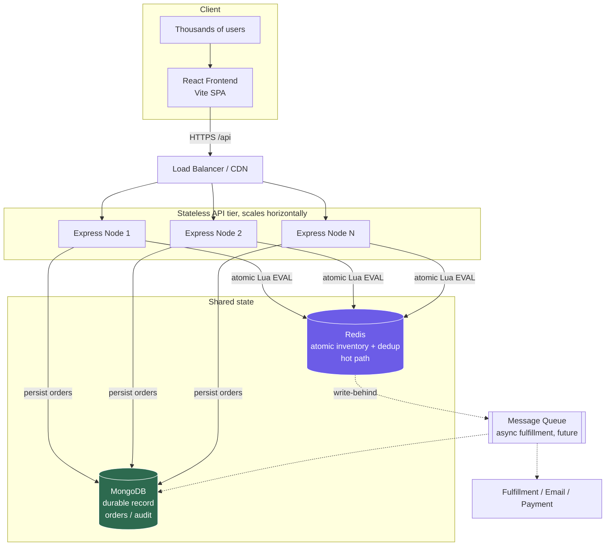
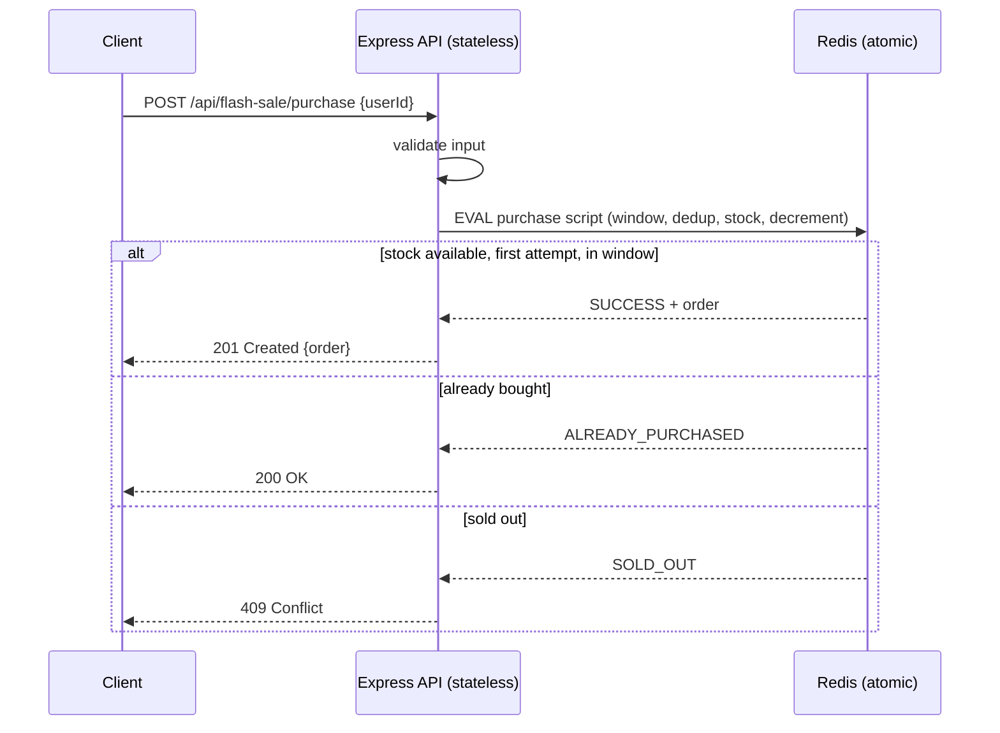

# High-Throughput Flash Sale System

A flash sale backend and frontend for a single product with limited stock. It is built on the MERN stack (MongoDB, Express, React, Node.js) and uses Redis as the concurrency layer for the purchase hot path.

The whole point of the exercise is to get two rules right even when thousands of people hit "Buy Now" at the same instant:

1. Never sell more units than exist (no overselling).
2. Each user can buy at most one unit.

Everything below explains how that is done, how to run it, and how the stress tests prove it works.

## Table of Contents

- [Architecture](#architecture)
- [Design choices and trade-offs](#design-choices-and-trade-offs)
- [How concurrency is handled](#how-concurrency-is-handled)
- [Project structure](#project-structure)
- [Getting started](#getting-started)
- [Configuration](#configuration)
- [API reference](#api-reference)
- [Testing](#testing)
- [Stress testing](#stress-testing)
- [Fault tolerance and scaling](#fault-tolerance-and-scaling)

## Architecture



What happens on a single purchase:



The API servers hold no state of their own. All the contested state (remaining stock, who has already bought) lives in Redis, so you can run as many API instances as you like behind a load balancer. MongoDB keeps the durable copy of every order.

## Design choices and trade-offs

**Express + Node.js + TypeScript.** This is the MERN stack the team uses. The framework is not the bottleneck here, I/O is, so Express keeps things simple and familiar. TypeScript catches a class of mistakes at compile time.

**Redis on the purchase hot path.** Redis runs commands on a single thread and executes a Lua script as one atomic unit. That lets me fold the entire decision (is the sale open, has this user already bought, is there stock, decrement, record the order) into one indivisible operation. No locks, no read-then-write race. The cost is an extra piece of infrastructure, which I offset with an in-memory fallback so the project runs with nothing installed.

**MongoDB as the durable record.** This is the M in MERN. Orders need to outlive a process restart and be queryable later for fulfillment and reporting. The Mongo store is also a second, fully correct implementation of the same invariants, using a unique index on `userId` plus an atomic `findOneAndUpdate`. It is disk-bound so it is slower than Redis on the hot path, which is exactly why Redis is the gatekeeper and Mongo is the record of truth.

**One small store interface, three implementations.** `memory`, `redis`, and `mongo` all implement the same `FlashSaleStore` interface. The same business logic and the same tests run against all three. You get zero-setup local dev (`memory`), maximum throughput (`redis`), or full durability (`mongo`) by flipping one env var. It also makes the throughput-versus-durability trade-off concrete instead of hand-wavy.

**Purchases are idempotent per user.** If a user double-clicks or retries, they get `ALREADY_PURCHASED` with their existing order back, not an error and not a second unit. Under load clients retry constantly, so this matters.

**The sale window is checked inside the atomic step.** The open/closed check happens in the same operation as the stock check, so a request cannot slip through right at the boundary. The trade-off is that it trusts the API server clock; for multi-region you would centralize time.

### Why not a SQL row lock or SELECT ... FOR UPDATE?

It works, but it serializes every purchase on a row lock and adds database round-trips and contention right when traffic spikes. Redis gives the same correctness with much higher throughput and no lock contention.

### Why not just decrement an in-memory counter?

It is correct inside a single Node process, since JavaScript is single-threaded. That is why the `memory` store passes the same concurrency tests. But as soon as you run a second API instance (which you have to, to scale), each process has its own counter and they oversell. A shared atomic store is what makes horizontal scaling safe.

## How concurrency is handled

### Redis: one atomic Lua script

The whole purchase is a single `EVAL`. Because Redis runs the script atomically, two concurrent requests can never interleave their read and write:

```lua
-- KEYS[1]=stock, KEYS[2]=orders hash. ARGV: userId, now, start, end, orderId
local stock = redis.call('GET', KEYS[1])
if stock == false then return {'NOT_INITIALIZED', ''} end
if now < startTime then return {'NOT_STARTED', ''} end
if now > endTime then return {'ENDED', ''} end
if redis.call('HGET', KEYS[2], ARGV[1]) then return {'ALREADY_PURCHASED', existing} end
if tonumber(stock) <= 0 then return {'SOLD_OUT', ''} end
redis.call('DECR', KEYS[1])
redis.call('HSET', KEYS[2], ARGV[1], order)
return {'SUCCESS', order}
```

Full version in [`server/src/store/redisStore.ts`](server/src/store/redisStore.ts).

### MongoDB: atomic conditional update plus a unique index

This works on a plain standalone `mongod` with no transactions:

1. Insert the order first. The unique index on `userId` makes the database itself reject a duplicate buyer, which is the atomic "one per user" guarantee.
2. Claim a unit of stock with `findOneAndUpdate({ stock: { $gt: 0 } }, { $inc: { stock: -1 } })`. Mongo applies this to a single document atomically, so stock can never go negative.
3. If there was no stock left, delete the order that was just reserved.

See [`server/src/store/mongoStore.ts`](server/src/store/mongoStore.ts) for the full reasoning, including the one crash-window trade-off.

### Memory: a synchronous critical section

The in-process store does its check and decrement synchronously, with no `await` in the middle, so it is atomic within one Node process. Good for tests and a zero-dependency demo, not safe across multiple processes. See [`server/src/store/memoryStore.ts`](server/src/store/memoryStore.ts).

## Project structure

```
.
├── server/                 # Express + TypeScript API
│   ├── src/
│   │   ├── app.ts          # Express app factory (routes, validation, errors)
│   │   ├── index.ts        # Entrypoint, loads .env, graceful shutdown
│   │   ├── config.ts       # Env-driven configuration
│   │   ├── service.ts      # Business orchestration and sale-state derivation
│   │   ├── types.ts        # Shared types and the FlashSaleStore interface
│   │   └── store/
│   │       ├── memoryStore.ts   # In-process (default, tests/dev)
│   │       ├── redisStore.ts    # Atomic Lua (high throughput)
│   │       └── mongoStore.ts    # Durable, atomic via unique index + $inc
│   └── test/
│       ├── unit/store.test.ts            # store correctness and concurrency
│       └── integration/                  # API (supertest) + Redis/Mongo
├── frontend/               # React + Vite SPA
│   └── src/{App.tsx,api.ts,styles.css,main.tsx}
├── stress/
│   ├── stress.mjs              # throughput benchmark (autocannon)
│   └── verify-correctness.mjs  # proves no-oversell and one-per-user under load
├── docker-compose.yml      # Redis + MongoDB
└── package.json            # npm workspaces and top-level scripts
```

## Getting started

### Prerequisites

- Node.js 18 or newer (developed on Node 21).
- Docker, optional. Only needed for the Redis or Mongo backends. The default `memory` store needs nothing.

### 1. Install

```bash
npm install
```

### 2. Run the quick path with no infrastructure

```bash
# Terminal A: API on http://localhost:3000 using the in-memory store
npm run dev:server

# Terminal B: React app on http://localhost:5173 (proxies /api to the server)
npm run dev:web
```

Open http://localhost:5173, type a username or email, and click Buy Now.

Or run both together:

```bash
npm run dev
```

### 3. Run with Redis or MongoDB

```bash
docker compose up -d        # starts Redis (6379) and MongoDB (27017)

# Redis-backed (recommended for the load test):
#   PowerShell:  $env:STORE="redis"; npm run dev:server
#   bash:        STORE=redis npm run dev:server

# MongoDB-backed (durable):
#   PowerShell:  $env:STORE="mongo"; npm run dev:server
#   bash:        STORE=mongo npm run dev:server
```

### 4. Production build

```bash
npm run build       # builds server (tsc) and frontend (vite)
npm start           # runs the compiled server (server/dist/index.js)
```

## Configuration

Configuration comes from environment variables. The server reads `server/.env` on startup (see `server/.env.example`). Note that variables already set in your shell take precedence over `.env`.

| Variable | Default | Description |
| --- | --- | --- |
| `PORT` | `3000` | API port |
| `STORE` | `memory` | `memory`, `redis`, or `mongo` |
| `TOTAL_STOCK` | `100` | Units available for the sale |
| `SALE_START` | now | ISO string or epoch ms, when the sale opens |
| `SALE_END` | now + 2h | ISO string or epoch ms, when the sale closes |
| `REDIS_URL` | `redis://127.0.0.1:6379` | Redis connection string |
| `MONGO_URL` | `mongodb://127.0.0.1:27017/flashsale` | Mongo connection string |
| `ENABLE_ADMIN` | `true` | Exposes `POST /api/admin/reset`, used by tests and stress |

By default the sale is active immediately, so the demo and the stress tests work without setting any timestamps.

## API reference

| Method | Endpoint | Description |
| --- | --- | --- |
| `GET` | `/api/flash-sale/status` | Sale state (`upcoming`, `active`, `sold_out`, `ended`), stock, sold count, window |
| `POST` | `/api/flash-sale/purchase` | Attempt a purchase. Body: `{ "userId": "ada@example.com" }` |
| `GET` | `/api/flash-sale/purchase/:userId` | Check whether a user secured an item, returns their order |
| `POST` | `/api/admin/reset` | Reset stock and clear buyers. Body: `{ "totalStock": 100 }`. For testing and stress |
| `GET` | `/health` | Liveness probe |

Purchase outcomes and the HTTP status they map to:

| Status | HTTP | Meaning |
| --- | --- | --- |
| `SUCCESS` | `201` | Item secured |
| `ALREADY_PURCHASED` | `200` | User already owns one (idempotent) |
| `SOLD_OUT` | `409` | No stock left |
| `NOT_STARTED` or `ENDED` | `403` | Outside the sale window |
| invalid input | `400` | Missing or invalid `userId` |

Example:

```bash
curl -X POST http://localhost:3000/api/flash-sale/purchase \
  -H "Content-Type: application/json" \
  -d '{"userId":"ada@example.com"}'
```

## Testing

```bash
npm test          # runs the server unit and integration suite (Vitest)
```

- Unit tests (`test/unit/store.test.ts`) hit the store directly, including a 5,000-concurrent-attempt no-oversell test and a one-per-user-under-concurrency test.
- Integration tests (`test/integration/api.test.ts`) run the real Express app end to end with supertest: purchase, idempotency, sold out, order lookup, input validation, and window enforcement before and after the sale.
- Redis and Mongo store tests (`test/integration/redisStore.test.ts`, `mongoStore.test.ts`) fire 10,000 (Redis) and 3,000 (Mongo) concurrent attempts and assert exactly `stock` successes. They skip themselves automatically if the datastore is not reachable, so `npm test` always passes with nothing installed.

To include the Redis and Mongo tests, start the containers first:

```bash
docker compose up -d
npm test            # now all 16 tests run, none skipped
```

## Stress testing

There are two scripts in [`stress/`](stress/). Start the server first, ideally on Redis:

```bash
docker compose up -d
# PowerShell:  $env:STORE="redis"; $env:DISABLE_REQUEST_LOGGING="true"; npm start
# bash:        STORE=redis DISABLE_REQUEST_LOGGING=true npm start
```

### 1. Correctness under load: npm run stress:verify

This is the one that actually proves the invariants. It fires thousands of requests and asserts on the exact outcome:

```bash
npm run stress:verify
# tunable: STOCK=100 USERS=5000 BASE_URL=http://localhost:3000 npm run stress:verify
```

Expected output:

```
[Test 1] No oversell: 5000 distinct users vs stock=100
  Outcomes: { SUCCESS: 100, SOLD_OUT: 4900 }
  PASS: exactly 100 SUCCESS
  PASS: remaining stock is 0
  PASS: sold count is 100
[Test 2] One item per user: 50 spammers x 20 concurrent requests each
  Outcomes: { SUCCESS: 50, ALREADY_PURCHASED: 950 }
  PASS: each of 50 users won exactly once
ALL CHECKS PASSED, no overselling, one item per user upheld under load.
```

In plain terms: 5,000 users fought over 100 units and exactly 100 sold. 1,000 duplicate requests from 50 users produced exactly 50 winners.

### 2. Throughput benchmark: npm run stress

Measures requests per second and latency with autocannon:

```bash
npm run stress
# tunable: CONNECTIONS=200 DURATION=15 STOCK=1000000 BASE_URL=... npm run stress
```

Numbers measured on a Windows dev laptop (Node 21, single API process, 200 connections, 15s):

| Store | Throughput | p50 | p99 | Errors |
| --- | --- | --- | --- | --- |
| memory (in-process) | ~8,400 req/s | 23 ms | 36 ms | 0 |
| redis (Docker) | ~6,800 req/s | 28 ms | 54 ms | 0 |

The memory store is faster on one box because a purchase is just a function call. Redis adds a network round-trip per purchase (and on Windows the Docker network boundary adds more), so it is roughly 20 percent slower per node here. That is the expected trade-off: memory is faster but only correct on one process and loses everything on restart, while Redis is a shared, durable, atomic source of truth that lets you scale the API tier horizontally. Since the API is stateless, real aggregate throughput is roughly the per-node number times the number of nodes, and Redis itself (100k+ ops/s on one node) is nowhere near saturated.

## Fault tolerance and scaling

- No overselling under failure. The decrement and the order record are written in the same atomic operation, so a crash cannot leave stock decremented without a recorded order (Redis), and the Mongo path compensates on the rare interleaving.
- Safe retries. Purchases are idempotent per user, so clients and load balancers can retry without double-charging or burning extra stock.
- Durability. Redis runs with AOF persistence (`--appendonly yes` in `docker-compose.yml`) and MongoDB holds the durable order record. In production you would add Redis replicas with Sentinel or Cluster, and a Mongo replica set.
- Horizontal scale. The API holds no state, so you add Node instances behind a load balancer. All contention is resolved in Redis at O(1) per purchase.
- Graceful shutdown. SIGINT and SIGTERM drain in-flight requests and close datastore connections before exit.
- Future work, mocked here. A message queue (RabbitMQ, SQS, or similar) for async fulfillment. Redis grants the reservation instantly on the hot path, and a worker drains the queue to handle payment, email, and shipping. This keeps slow downstream systems off the critical path during a spike. It is the dotted component in the architecture diagram.

## Summary

This is a flash sale system that stays correct under heavy concurrency (proven by the test suite and a separate load harness), scales by keeping the API stateless and pushing contention into a shared atomic store, and is honest about its trade-offs by shipping three interchangeable store backends.
